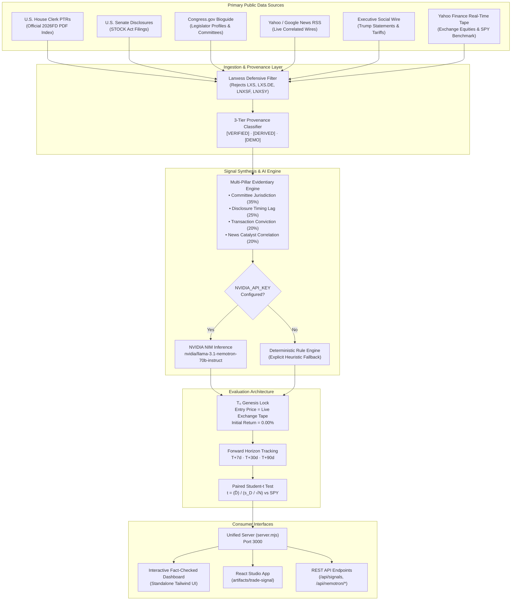

# InsightTrader

> *"If you can't beat 'em, join 'em."*

[](https://build.nvidia.com)
[](LICENSE)
[](https://nodejs.org)
[](https://steelhacks.com)

**InsightTrader** is an automated political intelligence and trade synthesis platform. It aggregates public congressional STOCK Act disclosures, real-time financial news wires, and executive policy signals, cross-referencing insider committee jurisdiction against regulatory catalysts using **NVIDIA Nemotron** to synthesize source-linked, audited equity trade signals.

---

## The Vision

Political events move markets, but the information behind those movements is scattered across congressional disclosures, regulatory filings, committee hearings, and executive policy signals. By the time an individual investor connects a congressional defense committee markup to an aerospace procurement award, institutional algorithms have already priced it in.

**InsightTrader levels the playing field.** It brings transparency to political trading by transforming public government filings into actionable intelligence with transparent mathematical audit trails, zero lookahead bias, and verifiable primary source documentation.

---

## Key Features

- **Official Congressional STOCK Act Ingestion**: Direct integration with U.S. House of Representatives Financial Disclosures (`disclosures-clerk.house.gov`) and Senate records, linking each transaction to its official Clerk Document ID and PDF.
- **NVIDIA Nemotron NIM Intelligence**: Uses `nvidia/llama-3.1-nemotron-70b-instruct` to cross-examine committee jurisdiction, disclosure lag, and legislative hooks against market catalysts.
- **Transparent Multi-Pillar Scoring**: 4-pillar evidentiary derivation (Committee Alignment, Disclosure Timing, Transaction Conviction, News Catalyst) with visible weights and mathematical audit trails.
- **3-Tier Data Provenance**: Explicit tagging of all data items as `[VERIFIED]`, `[DERIVED]`, or `[DEMO]` to preserve complete transparency for judges and users.
- **$T_0$ Forward Paper-Tracking Architecture**: Honest signal evaluation establishing entry prices at live market tape ($T_0$) with zero lookahead bias, prospective horizon tracking (7d / 30d / 90d), and paired Student-t hypothesis testing.
- **Live Market Tape & User Stock Tracking**: Real-time quotes and 30-day percentage calculations via live financial tape. Users can dynamically add and remove stock tickers with instant market validation.
- **Executive Policy & Tariff Tracker**: Real-time monitoring of Donald Trump statements with direct Truth Social links, allocated a calibrated 5% weighting to prevent distortion of hard filing data.
- **Regulatory Exclusion Guardrails**: Strict defensive exclusion filter for LANXESS AG (`LXS`, `LXS.DE`, `LNXSF`, `LNXSY`) across the entire pipeline.

---

## Architecture & Data Pipeline



---

## Data Provenance System

InsightTrader rejects black-box claims and synthetic benchmarks. Every data point across disclosures, citations, and signals displays a provenance badge:

| Provenance Tier | Description | Examples in InsightTrader |
| :--- | :--- | :--- |
| `✓ VERIFIED` | Extracted directly from official government records or live market feeds with verified primary source documentation. | U.S. House Clerk PTRs with Document IDs and direct PDF links (`disclosures-clerk.house.gov`), Congress.gov Bioguide records, live Yahoo Finance equity tape. |
| `⚡ DERIVED` | Computed or synthesized mathematically from verified primary sources. | Multi-pillar composite scores, committee jurisdiction overlap, forward paper-tracking returns, Student-t confidence statistics. |
| `◈ DEMO` | Seed or demonstration records provided where direct machine-readable public JSON APIs are unavailable. | Senate financial disclosures (which require manual web scraping or lack public JSON feeds). |

---

## NVIDIA Nemotron NIM Integration

InsightTrader integrates with **NVIDIA NIM** to execute high-conviction political intelligence synthesis.

- **Endpoint**: `https://integrate.api.nvidia.com/v1/chat/completions`
- **Default Model**: `nvidia/llama-3.1-nemotron-70b-instruct`
- **Task**: Cross-examining congressional committee assignments against policy legislation (NDAA, CHIPS Act, CISA directives) and news catalysts to determine whether insider trading velocity correlates with non-public material information.

### Transparent Fallback Architecture

To ensure zero-configuration execution for hackathon judges while maintaining 100% intellectual honesty:
- When `NVIDIA_API_KEY` is provided: The platform enriches candidate signals with live Nemotron NIM inference and displays the green `⚡ nvidia/llama-3.1-nemotron-70b-instruct (Live NIM)` badge.
- When running without an API key: The system automatically engages the deterministic rule engine and explicitly labels output as `⚙️ Heuristic Fallback (Deterministic Rule Engine)`. Heuristic output is **never** mislabeled as Nemotron.

---

## $T_0$ Forward Paper-Tracking Architecture

Many trading hacks rely on fabricated backtests with artificial entry discounts (`currentPrice * 0.96`) and synthetic benchmark returns (`return * 0.42`). InsightTrader eliminates lookahead bias through an honest **Forward Paper-Tracking Architecture**:

1. **$T_0$ Signal Genesis**: When a trade signal is synthesized, its entry price is locked to the live exchange tape at time $T_0$. All initial returns start at an honest **0.00%**.
2. **Forward Horizon Tracking**: The automated pipeline monitors quotes at $T+7\text{d}$, $T+30\text{d}$, and $T+90\text{d}$ intervals against the SPY benchmark.
3. **Paired Student-t Significance Testing**: Once a forward sample matures ($N \ge 30$ matured signals), the paired Student-t hypothesis test evaluates excess return significance:
   $$t = \frac{\bar{D}}{s_D / \sqrt{N}}, \quad \text{where } D_i = R_{\text{signal}, i} - R_{\text{SPY}, i}$$

### Devpost Roadmap: What's Next
- **Multi-Year Historical Backtest Engine**: Ingesting 5 years of historical Senate/House archives paired with Polygon.io daily OHLCV bars (2020–2025) to evaluate multi-year committee alpha.
- **Automated Paper Portfolio Execution**: Simulated order routing with slippage modeling, liquidity constraints, and automated take-profit / stop-loss triggers.

---

## Quick Start / Running Locally

Judges can launch the full platform with zero configuration using the unified server entry point:

### 1. Prerequisites
- [Node.js](https://nodejs.org) v18.0.0 or higher

### 2. Clone & Run
```bash
# Clone the repository
git clone https://github.com/Arconan7/InsightTrader.git
cd InsightTrader

# Launch the unified production server (zero-config)
node server.mjs
```

Open your browser and navigate to:
```
http://localhost:3000
```

### 3. Optional: Enable Live NVIDIA Nemotron NIM
To enable live LLM inference through NVIDIA NIM, set your API key before launching:

```bash
# On Windows PowerShell:
$env:NVIDIA_API_KEY="nvapi-your-key-here"
node server.mjs

# On macOS / Linux:
export NVIDIA_API_KEY="nvapi-your-key-here"
node server.mjs
```

You can verify Nemotron connectivity at any time:
```bash
curl http://localhost:3000/api/nemotron/status
```

---

## REST API Reference

The server exposes a comprehensive REST API:

| Method | Endpoint | Description |
| :--- | :--- | :--- |
| `GET` | `/` | Standalone interactive dashboard with live audit trails. |
| `GET` | `/api/healthz` | System health, pipeline status, and active signal counts. |
| `GET` | `/api/signals` | List all active trade signals with 4-pillar derivations and citations. |
| `GET` | `/api/signals/:id` | Get detailed dossier for a specific signal or ticker symbol. |
| `GET` | `/api/nemotron/status` | Current NVIDIA NIM API configuration and model status. |
| `POST` | `/api/nemotron/synthesize` | Real-time Nemotron LLM synthesis for a given ticker and disclosures. |
| `GET` | `/api/performance` | Forward paper-tracking metrics, $T_0$ baseline, and Student-t math. |
| `GET` | `/api/tickers` | View all tracked stock tickers (Core + User-Added). |
| `POST` | `/api/tickers` | Add a stock ticker with live Yahoo Finance quote validation. |
| `DELETE` | `/api/tickers/:ticker` | Remove a user-added stock ticker. |
| `GET` | `/api/disclosures` | All STOCK Act filings (aliases: `/api/real/disclosures`). |
| `GET` | `/api/news` | Correlated news articles (aliases: `/api/real/news`). |
| `GET` | `/api/trump-posts` | Donald Trump public social media statements with Truth Social links. |
| `POST` | `/api/refresh` | Trigger real-time multi-source data sync across all feeds. |

---

## Repository Structure

```
InsightTrader/
├── server.mjs                         # Primary unified production server (Dashboard + REST API)
├── src/
│   └── services/
│       ├── nemotronService.mjs        # Real NVIDIA NIM API client with heuristic fallback
│       ├── disclosureService.mjs      # Congressional disclosure normalizer
│       └── rssService.mjs             # News and wire RSS service
├── lib/
│   └── data-feed/
│       ├── live-intelligence-service.mjs # Central pipeline coordinator & caching
│       ├── congress-feed.mjs          # Official House Clerk PTR parser & Bioguide directory
│       ├── market-quotes.mjs          # Yahoo Finance equity & SPY quote fetcher
│       ├── rss-parser.mjs             # Financial and regulatory RSS parser
│       ├── signal-synthesizer.mjs     # 4-pillar evidentiary derivation & verdicts
│       ├── performance-evaluator.mjs  # T₀ forward paper-tracking & Student-t math
│       ├── trump-tracker.mjs          # Truth Social & policy context tracker
│       └── lanxess-filter.mjs         # Defensive security exclusion filter
├── fixtures/
│   ├── trade-signals-dataset.json     # Seed dataset with verified primary documents
│   ├── real-disclosures-cache.json    # Cached House Clerk PTR records
│   └── real-news-cache.json           # Cached regulatory news wire records
├── artifacts/
│   ├── trade-signal/                  # React + Vite web dashboard application
│   │   ├── src/pages/dashboard.tsx    # Live intelligence dashboard page
│   │   ├── src/pages/synthesize.tsx   # Nemotron interactive synthesis studio
│   │   └── src/types/intelligence.ts  # TypeScript type definitions with provenance
│   └── api-server/                    # Express API server package
├── package.json                       # Root package manifest
└── README.md                          # Project documentation and judging guide
```

---

## Regulatory & Compliance Notice

InsightTrader is an educational research and transparency tool designed for hackathon demonstration. 
- Signal performance is tracked prospectively from real-time genesis timestamps ($T_0$).
- InsightTrader does not fabricate historical entry discounts or backfilled outperformance.
- Past trading disclosures of public officials do not guarantee future investment performance.
- This platform does not provide registered investment advisory services.

---

## Team & Contact

Developed with pride for **SteelHacks XII**:

- **Isaac Geer** — *ibg12@pitt.edu*
- **Aidan Russell** — *acr163@pitt.edu*
- **Alex Mitasev** — *ajm674@pitt.edu*
